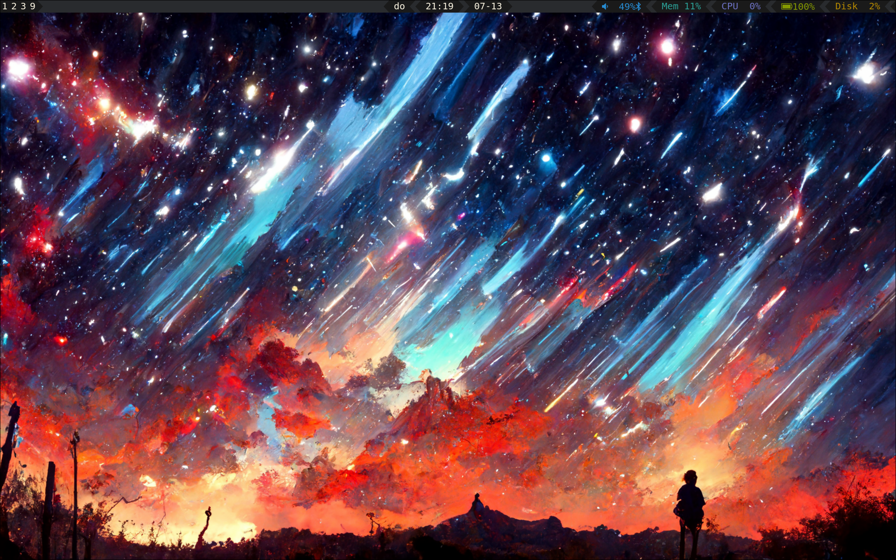
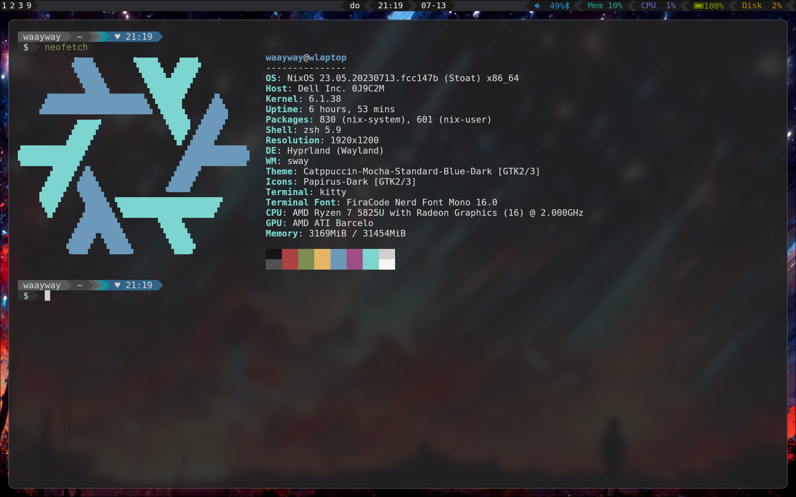
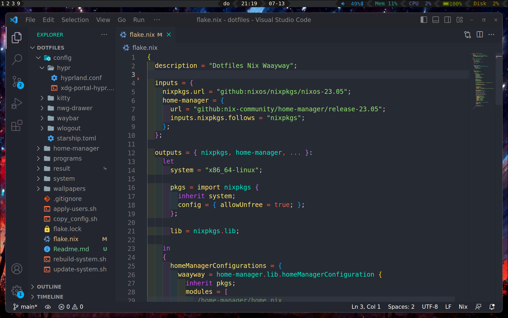

# Actuall good setup of nixos
Had a setup of nixos was trying it out but was always lacking in how to set it up....

now with some more knowledge made this.

Thank the heavens for Wil T for his youtube series on nixos and flakes without it i would have been very lost.

## Programs and services i am using
- Hyprland
- Waybar
- dunst
- swww
- hyprpicker
- nwg-drawer
- and many more, but these are the main ones for the desktop

## Some images

